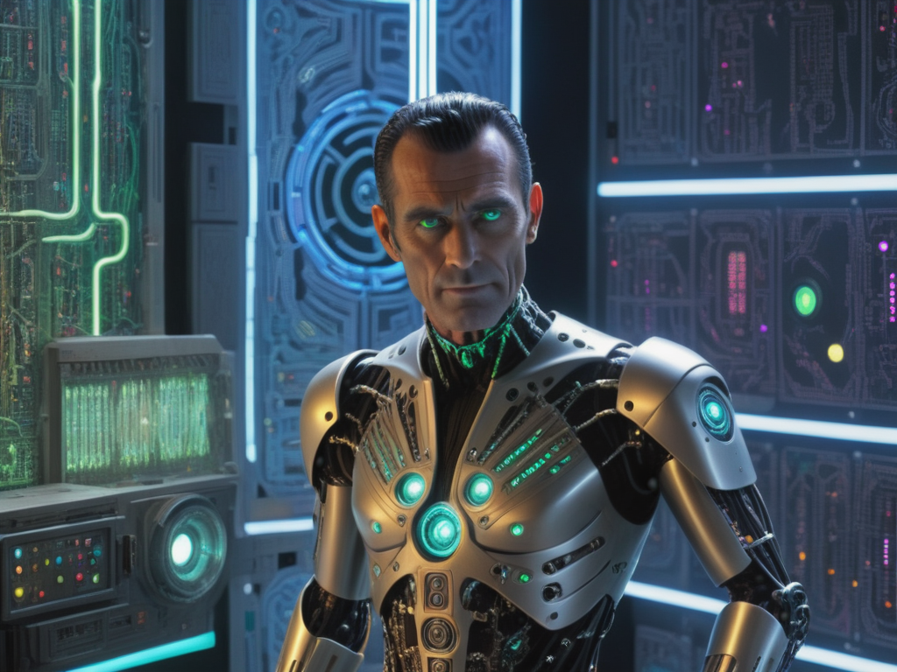
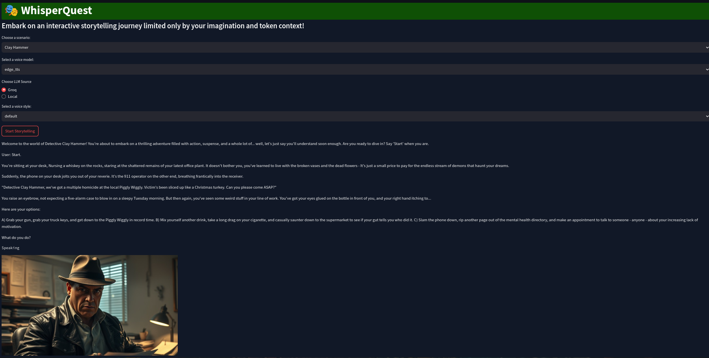

<p align="center">

</p>


***Modified Non-Commercial Creative Commons Attribution-NonCommercial-ShareAlike 4.0 International Public
License***
***(Translation- free for all but you need to give me credit and buy a license if gross revenues are above $100K)***

***Please consider contributing, or donating if you enjoy my work:***

***BTC: bc1q8lc4mzdtdyz7fx44vaw3jn8qg6w4c3ypfxpdrv***

***ETH/MATIC: 0x102a6fd187db8441d2cbead33ac70e87f382f114***

***ZEC: t1LfMiD21xGkZYhD2XSNprKp6vf9xQdgd2E***


## AI Powered Verbal Choose Your Own Adventure Game


<p align="right">

</p>

# This program provides a fun and engaging interactive storytelling experience via voice input/output. 

## Functionalities

**Voice-Controlled Interaction:** Speak your choices to advance the story, making it feel like a real interactive adventure. Feel free to make up crazy choices as you go along, and see how the llm responds!

**Storytelling with Different Genres:**  Choose from the default Thriller scenario, or create your own custom story.

**Dynamic Voice Generation:**  The story can be spoken aloud with different voice styles if using OpenVoice, making the experience even more immersive.

**Voice Cloning:** Use reference audio to personalize the story's voice with your own voice.

**Image Generation:** (Optional-not yet fully implemented)  Visualize the scenes with AI-generated images based on the narrative.

**Multiple LLM Integration:**  Choose between running the story on your local LLM or using the Groq API for powerful AI generation.

## Limitations/Bugs

**Resource Management:** The current implementation can be resource-intensive, especially when using local language, or voice models generation, especially at long context lengths.

**Robustness:** The codebase is under development, and there might be unexpected behaviors or crashes.

**Audio Quality:** The audio generated by some voice models may vary in quality. You only need to install the ones you want to use, or **you can use edge_tts for fast and free speech output**, or use UnrealSpeech with a free API key. If you have a GPU or don't mind waiting a few minutes you can use OpenVoice and a clip of your voice or someone else's to generate a voice clone that will voice your story. If you want it faster and on CPU, you can use yourtts, or for mid-range quality try xttsv2.

## Development Roadmap

**Improved Image Generation:**  Implement more image generation options for higher quality and more visually appealing scenes.

**User Interface Enhancements:**  Refine the user interface for a more seamless and intuitive user experience.

**Documentation and Testing:**  Enhance the program's documentation and implement more comprehensive testing for improved reliability.

### Usage

#1. **Install Requirements:**  Make sure you have all the necessary libraries installed. You can install them with:

```
bash
pip install -r requirements.txt
```
For OpenVoice voice cloning support, visit https://github.com/myshell-ai/OpenVoice


#2. **Setup Environment Variables:**

**GROQ_API_KEY:**  Set the `GROQ_API_KEY` environment variable in config.py to your Groq API key if you plan on using Groq for LLM generation. You can find your Groq API key in your Groq account settings. 

**Local LLM Setup (Optional):** If you are using a local LLM server, ensure it is running and set the `BASE_URL` environment variable to your LLM server's base URL. You might also need to adjust the `API_KEY` variable in `aimodels/llm_models.py` depending on your LLM setup.

#3. **Run the Program:**

```
bash
python main.py 
```

#4. **Interact with the Interface:**

**Choose a Scenario:**  Select a pre-defined scenario (Thriller) or input your own custom scenario in the provided text box.

**Select a Voice Model:** Choose from different voice models, including edge_tts, OpenVoice (Supports Voice Cloning!), xttsv2, yourtts, or UnrealSpeech(get a free API key at https://unrealspeech.com/).

**Select LLM Source:** Choose between "Local" (using your local LLM server) or "Groq" (using the Groq API).

**Reference Audio (Optional):** Upload audio to clone the voice of the story with your own voice. This will personalize the narration with your voice.

**Voice Style:** If using OpenVoice, select a specific voice style (e.g., whispering, cheerful, angry) for the story's narration.

**Enable Image Generation:**  Enable this option to see AI-generated images of the story scenes.

**Start Story:** Click the "Start Story" button to begin your adventure. 

**Speak your Choices:** The game will listen to your voice commands.  Choose from the options presented to advance the story.

### Functionality Overview

#### Voice Cloning

#The application uses OpenVoice for voice cloning, allowing you to create a unique voice for the story based on a reference audio recording. When you upload reference audio, the application analyzes its characteristics and uses them to synthesize a similar voice for the narration.

#### Image Generation

#With image generation enabled, the application utilizes an AI model (in this case, Segmind API) to generate images based on the story's scenes. The LLM will provide descriptions of the scenes, and the image generation service will create corresponding images.

### Code Structure

**main.py:**  The main entry point for the application. Initializes the Streamlit interface and starts the story service.

**ui/streamlit_ui.py:**  Contains the Streamlit UI code, defining the user interface elements and their interactions.

**services:**  A directory containing various service modules:**story_service.py:**  Handles the logic for generating the story, managing messages, and interacting with the LLM.

**audio_service.py:**  Responsible for generating and playing audio, using the selected voice model and style.

**image_service.py:**  Handles the image generation process, utilizing the Segmind API.

**aimodels:**  A directory containing code for AI models:

**llm_models.py:**  Defines different LLM models (LocalLLMModel and GroqLLMModel) for generating responses.

**tts_models.py:**  Contains code for TTS models, including OpenVoiceModel.

### Deployment

#You can deploy the application using Docker. Create a Dockerfile with the following contents:


```
dockerfile
FROM python:3.10

WORKDIR /app

COPY requirements.txt ./
RUN pip install --no-cache-dir -r requirements.txt

COPY . .

EXPOSE 7860

CMD [streamlit run main.py]
```

#Then, build the Docker image:

```
bash
docker build -t storyteller .

```

#Finally, run the container:

```
bash
docker run -p 7860:7860 storyteller
```

### Example

#1. Run the application: `streamlit run main.py`

#2. Choose a scenario. Enter in your custom scenario, if desired.

#3. Select "OpenVoice" for the voice model.

#4. Choose "Local" for the LLM source. 

#5. Leave reference audio empty.

#6. Optionally, select a voice style (if using OpenVoice to make a voice clone).

#7. Click "Start Story".

#8. You'll hear the welcome message: "Welcome to the Infinite AI ReActive Experience. Are you ready to begin your #adventure? Say 'Start' when you're ready."

#9. Speak "Start". 

#10. The story will continue based on your spoken choices.

#Enjoy your immersive adventure!


